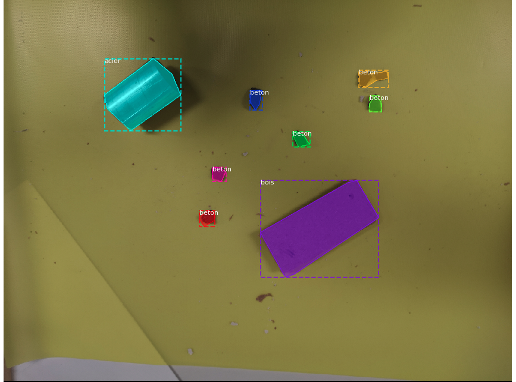

# Detritech Hackathon

  
  <em>Partial demo of the hackathon result</em>

This is the repo of a 1 week hackathon organized at my University (Ecole Centrale de Lille, in France).

The goal of the challenge was to use [a robot arm](https://www.universal-robots.com/products/ur10-robot/) to solve an issue in the construction industry. Our group project was to make a waste-sorting robot arm.

The robot takes in an image (taken from a phone), treats it in real-time through a Deep Learning algorithm on the cloud, and then controls the robot arm in order to push the waste off the conveyer belt into the right bins.

I was in charge of the Deep Learning Algorithm as well as the Cloud Infrastructure. Luca Jakomulski was in charge of the Android App and the control of the robot.

#### Table of Contents:

- [Detritech Hackathon](#detritech-hackathon)
      - [Table of Contents:](#table-of-contents)
  - [Content of the repo](#content-of-the-repo)
  - [Data flow and Cloud Infrastructure](#data-flow-and-cloud-infrastructure)
  - [Deep Learning Algorithm](#deep-learning-algorithm)
  - [Results](#results)

## Content of the repo

On this repo, you'll find:

- The Deep Learning algorithm used. This is a fork of [Matterport's implementation of Mask RCNN](https://github.com/matterport/Mask_RCNN). Our own code is under `samples/detritech`.
- A small visualisation website (built with React.js) under `visualisation/`.
- The algorithm used to control the robot under `robot_controller`.
- The code for the photo taking Android app under `android_app`.

## Data flow and Cloud Infrastructure

Because we were working with limited time and resources, we used the cloud extensively to connect the different components of the whole project.

The whole thing worked as follows:

1. We triggered the phone to shoot a new photo from the cloud (while running our Android Application);
2. That photo was then uploaded on the cloud;
3. When that was done, it was downloaded on a running Google Cloud Compute instance. The image was cropped so that only the conveyer belt remained on the image. Then inference was ran on it with a pre-trained Mask RCNN Deep Learning model;
4. The results in the form of bounding boxes were uploaded back up on the cloud;
5. Finally, the bounding boxes were downloaded by the program operating the robots, that then inferred the movements necessary to sort the waste and then executed them.

In order to support all that, we used Firebase Realtime Database for all text-based communication, Firebase Storage to store the photos. To run the model we used Google Cloud Compute.

## Deep Learning Algorithm

We forked the Matterport's implementation of Mask RCNN. To train it, we labeled custom data (around 100 images) using the [VIA annotator tool ](https://www.robots.ox.ac.uk/~vgg/software/via/). The data was labeled for a segmentation task (i.e. pixel-by-pixel object prediction).

The code to train the model and make inference was mainly based in the balloon sample, and adapted to our needs.

When trained, the weights were uploaded to the GCP instance to run fast inference in real time.

_Example output of the Deep Learning algorithm. Three classes are recognized: acier (steel), bois (wood), and béton (concrete)._

## Results

The results were superior to our expectations given the limited time-frame we were working with.

The Deep Learning algorithm worked well, making nearly no mistakes. However, it should be noted that we worked with only 3 classes (wood, concrete and metal) and that real construction waste would be more complexe. And the other hand, we only had 100 labeled images and trained the model (from coco weights) with only 10 epochs of 100 iterations each.

Based on the bounding boxes generated by the DL model, the robot was able to properly push the waste in the right bin.
